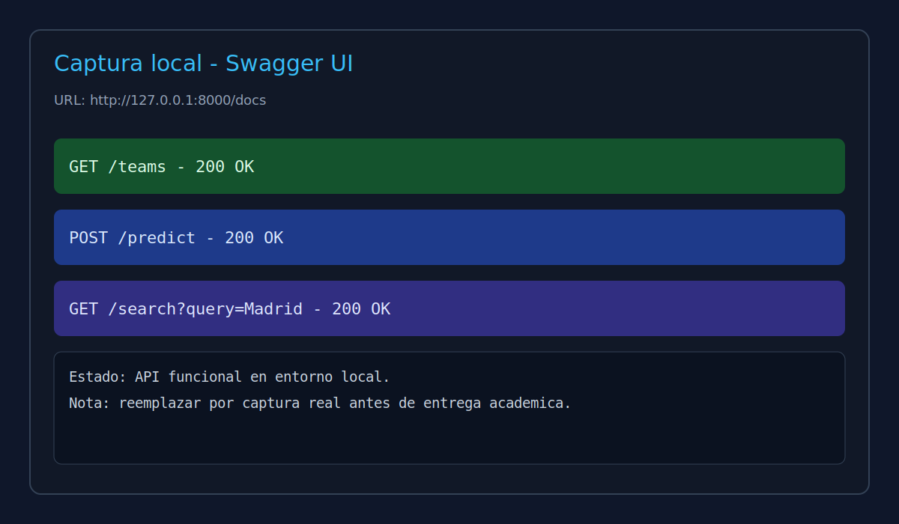
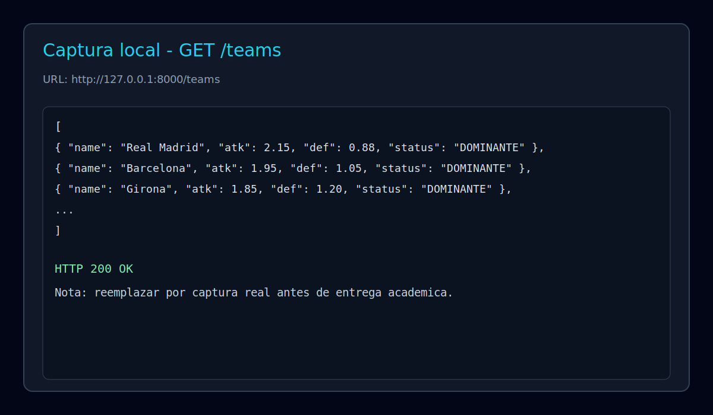

# Sports Analytics Engine

Proyecto de analitica deportiva consolidado en un solo codigo base (`sports-analytics-engine`), sin subproyectos duplicados.

## Alcance
1. API en FastAPI para probabilidades 1X2.
2. Web scraping de FBRef con limpieza de datos y exportacion a CSV.
3. Bot de Telegram con flujo de consulta y registro en base de datos SQLite.

## Entregables (actualizar links antes de enviar)
- Repositorio API/Bot: `https://github.com/Tefo10/sports-analytics-engine`
- Repositorio Scraping (separado): `PENDIENTE_CREAR_LINK_GITHUB`

## Tecnologias
- Python 3.10+
- FastAPI + Uvicorn
- Aiogram
- Playwright + Pandas
- NumPy + SciPy
- SQLite

## Estructura
```text
.
├── api.py
├── main.py
├── run_scraper.py
├── update_and_alert.py
├── requirements.txt
├── src/
│   ├── bot/handlers.py
│   ├── models/brain.py
│   ├── scraper/stealth_driver.py
│   └── utils/database.py
├── tests/
│   ├── test_api.py
│   └── test_brain.py
├── data/
└── docs/screenshots/
```

## Instalacion local
```bash
python -m venv .venv
.venv\Scripts\activate
pip install -r requirements.txt
python -m playwright install chromium
```

## API (FastAPI)

### Levantar servidor
```bash
uvicorn api:app --reload
```

### Endpoints
- `GET /health`
- `GET /teams`
- `GET /search?query=Madrid`
- `GET /front/match-inputs?home_team=Real%20Madrid&away_team=Barcelona`
- `POST /predict`
- `GET /scanner`

`GET /teams` ahora usa datos reales scrapeados desde FBRef (resultados jugados) y calcula metricas home/away.

### Ejemplo `POST /predict`
```json
{
  "home_name": "Real Madrid",
  "away_name": "Barcelona",
  "home_attack_power": 2.1,
  "away_defense_weakness": 1.1,
  "odds": { "L": 2.1, "E": 3.3, "V": 3.8 }
}
```

### Ejemplo `GET /front/match-inputs`
```json
{
  "equipo_local": "Real Madrid",
  "equipo_visitante": "Barcelona",
  "partidos_jugados_local": 13,
  "goles_a_favor_local": 31,
  "goles_en_contra_local": 10,
  "puntos_local": 33,
  "empates_local": 3,
  "partidos_jugados_visitante": 13,
  "goles_a_favor_visitante": 23,
  "goles_en_contra_visitante": 12,
  "puntos_visitante": 25,
  "empates_visitante": 4
}
```

## Scraping y CSV

### Fuente
- FBRef: `https://fbref.com/en/comps/12/stats/La-Liga-Stats`

### Flujo
1. Extraer tablas HTML con Playwright + Pandas.
2. Limpiar columnas multi-index.
3. Normalizar campos `name`, `xg`, `xga`.
4. Guardar salida en CSV (`data/la_liga_stats.csv`).

### Ejecutar scraping
```bash
python run_scraper.py
```

### Ejecutar pipeline de scraping + alertas
```bash
python update_and_alert.py
```

## Pruebas
```bash
python -m unittest discover -s tests -v
```

## Evidencia


